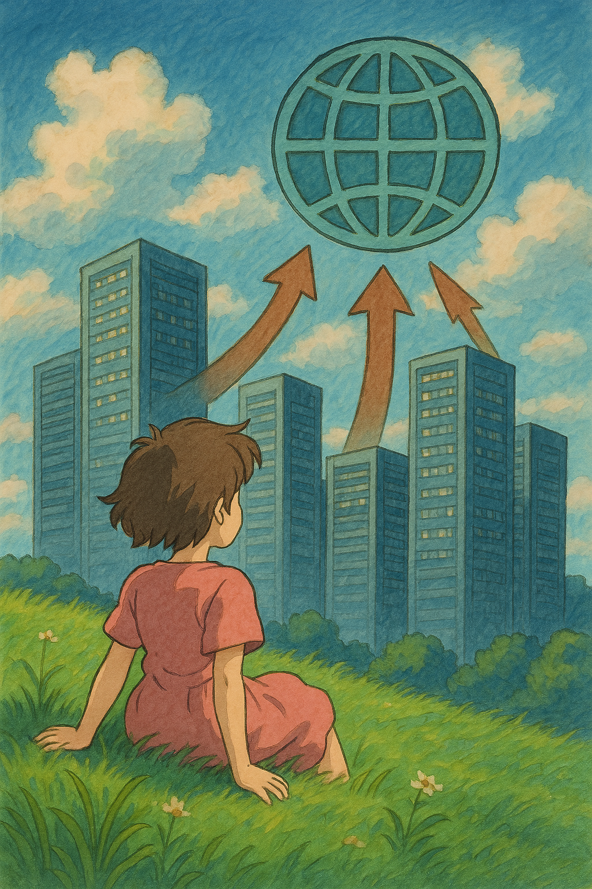

<!-- .slide: data-background="linear-gradient(to bottom right, #004080, #0070A0)" -->

## The Real Education Gap

- AI isn't magic, but systems will be rewritten
- Fear is boring — understanding is power

### Call to Action

> "Get curious. Ask weird questions. Build sovereign AI."

Sebastian Graf : Linkedin

Note: Reiterate key points, emphasize education over fear, invite collaboration on sovereign AI. 