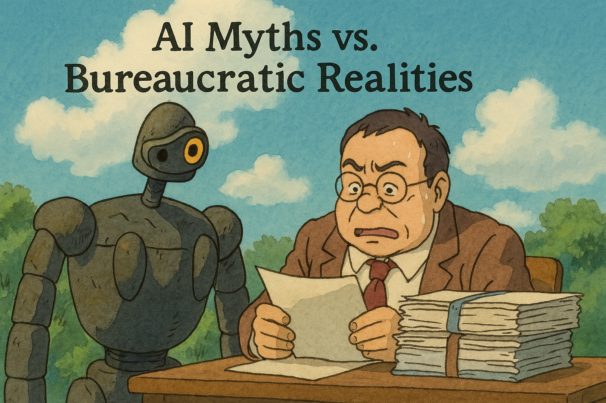

<!-- .slide: data-background="linear-gradient(to bottom right, #004477, #007799)" -->

- Superintelligence ≠ current reality
- Bureaucracy is the real monster
- Who controls who? Who interprets what?

Note: Reposition "AI fear" to real-world institutional friction. 