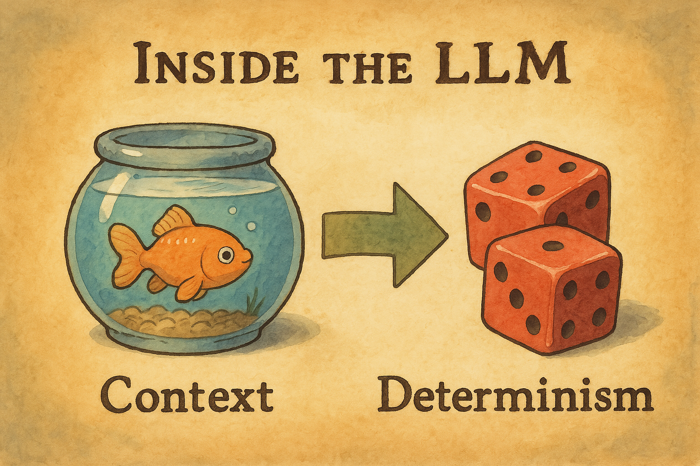

<!-- .slide: data-background="linear-gradient(to bottom right, #005588, #0088AA)" data-transition="slide" -->

## Demo 1: How LLMs Actually Think

### Context Windows

<!-- .element: class="fragment" data-fragment-index="1" -->
> Like a goldfish with a big vocabulary.

    
<small>Live Demo: Show context window limits & memory loss</small>

Note: Show example of a simple task failing due to lost context. 