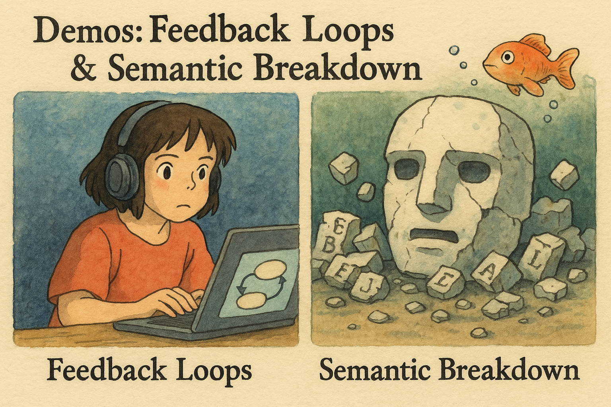

<!-- .slide: data-background="linear-gradient(to bottom right, #005588, #0088AA)" -->

    
Loop LLM output back into itself (5-10 times)

    
Watch degeneration into noise/meaninglessness

<!-- .element: class="fragment" -->
<blockquote data-id="demo3-quote">
"Torturing the language machine."
</blockquote>

Note: Break the illusion of 'intelligence' - they are function approximators, not minds. 